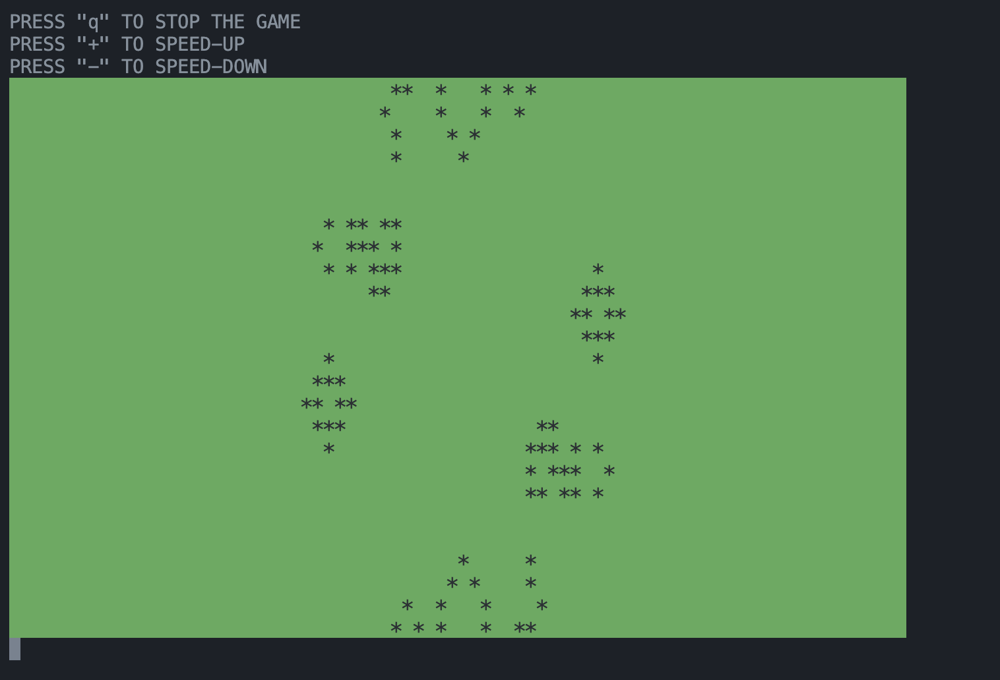

# 🦠 Conway's Game of Life


## About

The Game of Life is a cellular automaton invented by British mathematician John Conway in 1970.
It's a zero-player game: you set up the initial state and then simply watch it evolve.

This game is Turing complete — meaning it can simulate any Turing machine.

## 📜 Rules

The game takes place on a grid of square cells (potentially infinite, bounded, or toroidal).

Each cell:
* Has eight neighbors.
* Can be either alive (filled) or dead (empty).

At each step, the following rules determine the next generation:
* A dead cell with exactly three live neighbors becomes alive.
* A live cell with two or three live neighbors stays alive.
* Otherwise (fewer than two or more than three neighbors), the cell dies (from underpopulation or overpopulation).

The game stops if:
* All cells are dead.
* The configuration repeats a previous state (oscillator).
* The configuration becomes stable (no cells change).


## 🖼 Graphics

* The field is a rectangle of 80×25 cells.
* The grid wraps around itself (toroidal): e.g., the bottom-right cell has the bottom-left as a right neighbor and the top-right as a bottom neighbor.
* Initial state is loaded from stdin.


## ✅ Current result



## 🧩 Goals, ideas, and challenges

* <s>Make the game react to [q, +, -] keys without stopping.</s>
* Possibly create a full graphical interface (maybe using something other than Qt for fun).
  * If the GUI is built: allow users to design patterns manually, cell by cell, or load predefined figures.
  * Add adjustable field size, and possibly zoom using mouse wheel or keyboard.
  * Allow changing cell and field colors, and maybe even add background music.
  * Export user-created models to a file.

## 📦 Build

```Bash
make
./game_of_life
```
