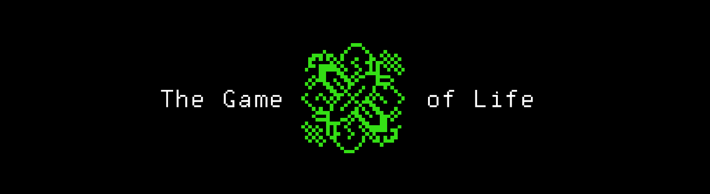

# Convay's game of LIFE

### "The Game of Life".
Игра «Жизнь» (англ. Game of Life) — клеточный автомат, придуманный английским математиком Джоном Конвеем в 1970 году.[1] Это игра без игроков[2][3], в которой человек создаёт начальное состояние, а потом лишь наблюдает за её развитием. В игре можно создать процессы с полнотой по Тьюрингу, что позволяет реализовать любую машину Тьюринга.

* ***Правила***

Место действия игры — размеченная на клетки плоскость, которая может быть безграничной, ограниченной или замкнутой.

Каждая клетка на этой поверхности имеет восемь соседей, окружающих её, и может находиться в двух состояниях: быть «живой» (заполненной) или «мёртвой» (пустой).

Распределение живых клеток в начале игры называется первым поколением. Каждое следующее поколение рассчитывается на основе предыдущего по таким правилам:

в пустой (мёртвой) клетке, с которой соседствуют три живые клетки, зарождается жизнь;

если у живой клетки есть две или три живые соседки, то эта клетка продолжает жить; 

в противном случае (если живых соседей меньше двух или больше трёх) клетка умирает («от одиночества» или «от перенаселённости»).

Игра прекращается, еслина поле не останется ни одной «живой» клетки;

конфигурация на очередном шаге в точности (без сдвигов и поворотов) повторит себя же на одном из более ранних шагов (складывается периодическая конфигурация)

при очередном шаге ни одна из клеток не меняет своего состояния (частный случай предыдущего правила, складывается стабильная конфигурация)

* ***Графика*** 

Поле — прямоугольник 80 на 25 клеток.
Подразумевается, что поле "замкнуто само на себя", к примеру у нижнего правого квадратика соседом справа является нижний левый квадратик, а соседом снизу - верхний правый.

Предусмотреть начальную инициализацию состояния "игры" через stdin.

***ПЕРВОНАЧАЛЬНЫЙ РЕЗУЛЬТАТ***

***ЦЕЛИ, ПРОБЛЕМЫ И ИДЕИ***

* сделать что бы игра реагировала на кнопки [q, +, -], не останавливаясь;
* может быть сделать ей полноценную графическую оболочку (может быть сделаю на какой нибудь 
  другой библиотеке отличной от Qt ради интереса);
* если предыдущий пункт будет воплощен, то прекрутить туда, расстановку для пользователя, как  
  поклеточно так и загружая полноценные фигуры;
* Сделать возможность задавать размеры поля и быть может масштабировать его колесиком мыши или 
  кнопками на клавиатуре;
* Дать возможность менять цвет поля и клеток, и даже если захочется запускать музыку;
* Экспортировать созданную пользователем модель в файл;
* Так же почти бредовая идея сделать так что бы игру можно было использовать в качестве 
  расширения в vscode.

